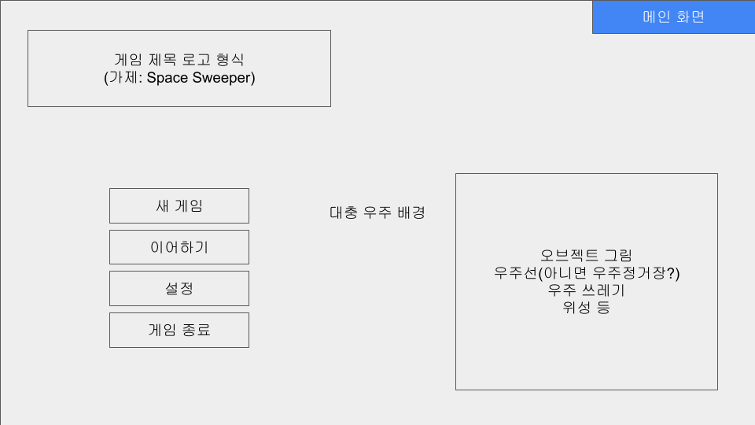
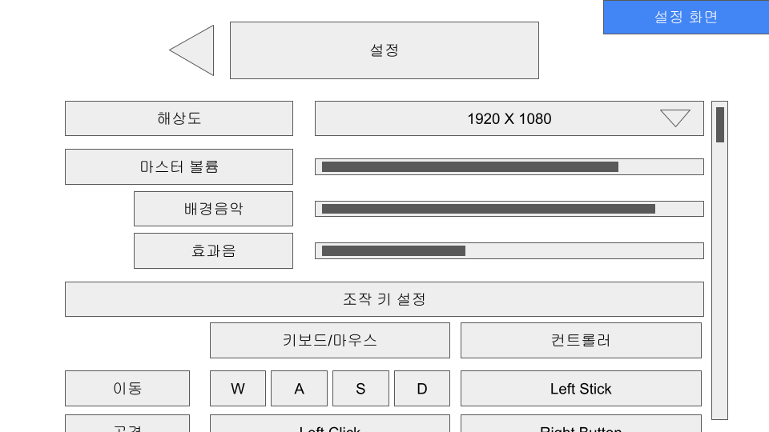
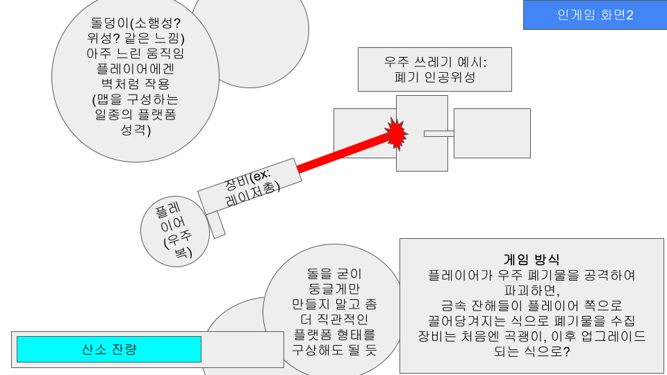
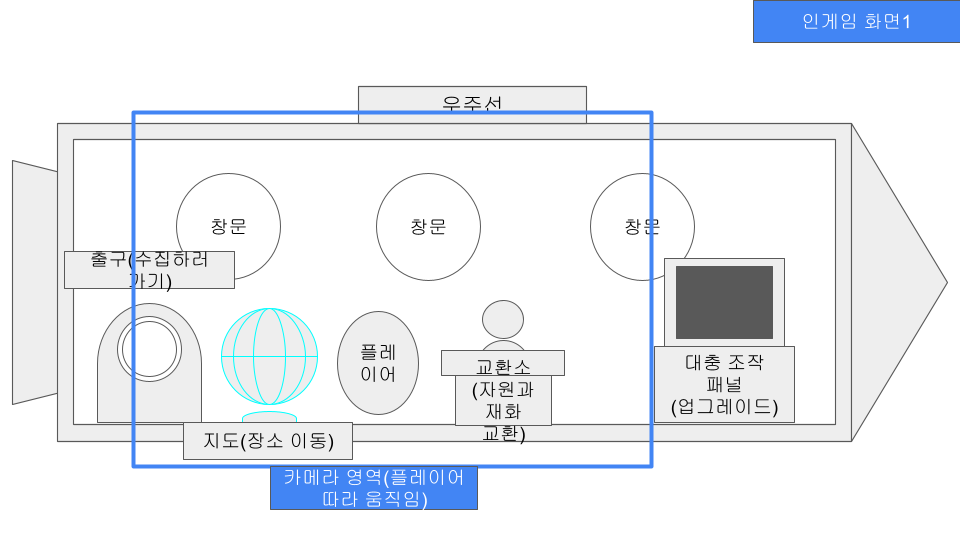
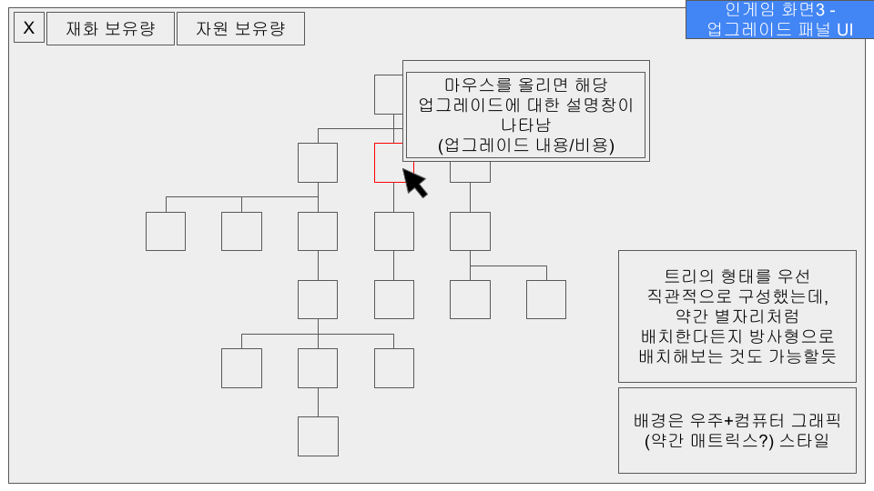

# Game Design Document: Space Sweeper (가제)

| **항목**        | **내용**                            |
| ------------- | --------------------------------- |
| **프로젝트 명**    | Space Sweeper (가제)                |
| **장르**        | 2D 사이드뷰 우주 파밍 액션 / 로그라이크(Lite)    |
| **엔진 / 플랫폼**  | Unity 6.3 LTS / PC (Windows, Mac) |
| **입력 장치**     | 키보드+마우스 / 게임패드 지원                 |
| **예상 플레이 타임** | 약 2시간                             |
| **작성일 / 버전**  | 2025-01-02 / v0.1                 |

## 1. 게임 개요

### 1.1. 기본 컨셉

	"우주는 거대한 쓰레기장이다. 그리고 나는 그곳의 청소부다."
산소가 제한된 우주 공간에서 부유하는 폐기물을 수집하고, 무사히 귀환하여 장비를 강화하는 반복 파밍 게임. 산소가 고갈되기 전 복귀해야 하는 긴장감과 기하급수적으로 성장하는 업그레이드의 쾌감을 핵심 재미로 삼는다.

### 1.2. 핵심 루프

1. **출격:** 우주선에서 탐사 지역으로 이동. 
2. **탐사 및 수집:** 제한된 산소(시간 제한) 내에서 폐기물 파괴 및 자원 획득.
3. **귀환:** 산소 고갈 전 우주선으로 복귀 (실패 시 획득 자원 전량 손실).
4. **정비 및 강화:** 획득한 자원을 재화로 교환하여 선체 및 장비 업그레이드. -> **더 먼 궤도로 진출.**

---

## 2. 게임플레이 메카닉

### 2.1. 캐릭터 조작

- **이동 방식:** 무중력 관성을 적용한 부유 이동. 초기에는 관성이 과하게 작용하여 세밀한 이동이 어려우나, 이후 추진 카트리지 업그레이드 시 대시 및 반동 제어로 보다 빠르고 정밀하게 이동 가능.
- **조작 체계:**

| **동작**    | **키보드/마우스**      | **컨트롤러**     | **비고**        |
| --------- | ---------------- | ------------ | ------------- |
| **이동**    | W, A, S, D       | Left Stick   |               |
| **조준**    | 마우스 커서           | Right Stick  | 탐사 모드 시       |
| **공격/채굴** | Mouse Left Click | RB           | 장비 사용         |
| **대시**    | Space            | LB           | 추진체 업그레이드 필요  |
| **상호작용**  | E                | Y / Triangle | 우주선 내/외부 상호작용 |

### 2.2. 탐사 시스템

- **산소 시스템 (Risk Factor):**
    - 화면 중앙 하단 혹은 플레이어 옆옆에 산소 잔량 표시.
    - 시간 경과에 따라 지속적으로 감소. 피격 시 추가 감소(페널티) 고려.
    - 산소가 0이 되기 전에 우주선 출입구와 상호작용하여 귀환해야 함.
- **채굴 및 전투:**
    - **대상:** 우주 쓰레기(폐인공위성, 파편), 소행성 등.
    - **방식:** 장비로 대상을 파괴하면 '금속 잔해' 등이 드롭되고, 플레이어 쪽으로 자력으로 끌려옴. 드롭량 및 수집 범위는 업그레이드 가능.

### 2.3. 환경 요소

- **지형:** 거대한 돌덩이가 플랫폼(벽) 역할을 수행. 
- **방해 요소:** 느리게 움직이는 장애물, 벽 역할의 소행성 등. 궤도가 멀어질수록 빠른 파편 등 위협 요소 등장.

## 2.4. 저장 시스템

### 2.4.1. 저장 방식

- **방식:** 단일 슬롯 자동 저장. 별도의 수동 저장 슬롯을 제공하지 않음.
- **파일 관리:** 로컬 디바이스(PC)에 JSON 혹은 바이너리 형태로 암호화하여 저장.

### 2.4.2. 저장 시점 (Triggers)

영구적인 데이터(재화, 스펙 등)가 변동되는 핵심 순간마다 자동으로 저장된다.

1. **탐사 종료 및 복귀 시:** 획득 자원 정산이 끝난 직후.
2. **거래 및 업그레이드 시:** 재화를 소비하거나 장비 등급이 변경되었을 때.
3. **설정 변경 시:** 옵션(볼륨, 키설정) 변경 후 저장 시.
4. **게임 종료 시:** 메인 메뉴로 나가거나 게임 종료 버튼을 눌렀을 때.

### 2.4.3. 저장 데이터 명세 (Data Schema)

저장해야 할 핵심 데이터 구조 (예시)

- **Player Data:**
    - 보유 재화
    - 현재 보유 자원 (탐사 중이 아닐 때는 0이어야 함, 창고 기능이 없다면)
- **Unlock Data:**
    - 해금된 궤도/맵 레벨
    - 업그레이드 트리 해금 상태 (해금된 노드 ID 리스트)
- **Settings:**
    - BGM/SFX 볼륨, 해상도, 키 매핑 정보

---

## 3. 성장 및 업그레이드

### 3.1. 경제 시스템

- **자원:** 폐기물 파괴 시 획득 (고철, 희토류 등).
- **재화:** 우주선 내 '교환소'에서 자원을 판매하여 획득.
- **리스크:** 탐사 실패(산소 고갈 등) 시 해당 회차에서 얻은 **자원 100% 소멸**.

### 3.2. 업그레이드 트리

UI는 트리 형태 혹은 방사형(별자리) 형태로 구성하며, 마우스 오버 시 상세 정보 표시.

#### A. 우주선

>업그레이드 트리의 루트 노드(기본 해금)

- **엔진 추력 개선:** 탐사 가능한 궤도(스테이지) 확장.
- **비상 복귀 시스템:** 산소 고갈 시 자원 손실 없이 자동 귀환.
- **고성능 탐지 레이더:** 탐사 시 등장하는 자원 밀도 증가.
- **웨어러블 제어 패널**: 어디서든 업그레이드 화면 호출 가능.
- **고철 정제기**

#### B. 장비

- **채굴 도구:** 곡괭이(기본) -> 샷건(근접 폭딜) -> 레이저건(원거리) 순으로 해금.
    1. **기본 장비: 곡괭이**
		- 근접 채굴.
		- 업그레이드 옵션: 대미지, 타격 속도, 사거리, 광역.
		- 섬세한 발굴: 폐기물 파괴 시 드롭되는 자원 파편의 수 증가
	2. **1단계 업그레이드: 샷건**
		- 대미지 총량 대폭 상승, 근접해야 유의미한 채굴 가능.
		- 업그레이드 옵션: 대미지, 반동 제어, 집탄률, 관통.
		- 정밀 타격: 폐기물 파괴 시 드롭되는 자원 파편의 수 증가
	3. **2단계 업그레이드: 레이저건**
		- 원거리 채굴 가능.
		- 업그레이드 옵션: 대미지, 타격 속도, 주변 전이.
		- 비파괴 시술술: 폐기물 파괴 시 드롭되는 자원 파편의 수 증가
- **우주복:**
    - **고농축 산소통**: 산소 용량(체류 시간) 증가.
    - **유압식 추진 카트리지**: 이동속도 증가.
	- **역추진 제어 시스템**: 반동 제어(관성 영향 감소, 조작감 개선).
	- **폭발적 압력 배출**: 대시 조작 해금.
    - **전자석 회수 봉투**: 아이템 획득 범위 증가.

---

## 4. UI / UX 디자인

	예시 이미지는 ppt 슬라이드 형식으로 화면 내의 요소들을 구상한 이미지(좌측)와,
	해당 이미지를 기반으로 Google Gemini Nanobanana로 생성한 컨셉 이미지(우측)를 함께 첨부하였다.
	이미지는 단순히 예시에 불과하며, 반드시 실제 게임 내 화면의 분위기를 반영하는 것은 아니다.
	오히려 현재는 캐주얼한 톤으로 생각 중에 있기에, 컨셉 이미지와 많이 방향성이 달라질 수 있음.

### 4.1. 메인 화면

- **게임 로고**
- **4개의 버튼**
	1. 새 게임
	2. 이어하기
	3. 설정
	4. 게임 종료
- 배경: 우주 테마, 인게임에서 마주할 폐기물이나 자원 파편 등이 떠다니는 모습으로 연출

<table width="100%">
  <tr>
    <td align="center" width="50%">
      
       
      <b>메인화면_구성</b>
    </td>
    <td align="center" width="50%">
      
       
      <b>메인화면_컨셉</b>
    </td>
  </tr>
  <tr>
    <td align="center" width="50%">
      
       
      <b>설정화면_구성</b>
    </td>
    <td align="center" width="50%">
      
       
      <b>설정화면_컨셉</b>
    </td>
  </tr>
</table>

### 4.2. 인게임 HUD

- **좌측 상단:** 보유 자원 및 재화량.
- **캐릭터 주변/하단:** 산소 잔량 게이지 (시인성 중요).
- **화면 중앙:** 플레이어 캐릭터
- **마우스 방향:** 조준점(Crosshair)

<table width="100%">
  <tr>
    <td align="center" width="50%">
      
       
      <b>탐사화면_구성</b>
    </td>
    <td align="center" width="50%">
      
       
      <b>탐사화면_컨셉</b>
    </td>
  </tr>
</table>

### 4.3. 우주선 내부 (Hub)

- 사이드뷰 형태의 우주선 단면도.
- **상호작용 오브젝트:**
    - 출구: 탐사 시작.
    - 지도: 맵(궤도) 선택.
    - 조작 패널: 업그레이드 UI 호출.
    - 교환소: 자원 판매.

<table width="100%">
  <tr>
    <td align="center" width="50%">
      
       
      <b>대기화면_구성</b>
    </td>
    <td align="center" width="50%">
      
       
      <b>대기화면_컨셉</b>
    </td>
  </tr>
  <tr>
    <td align="center" width="50%">
      
       
      <b>업그레이드화면_구성</b>
    </td>
    <td align="center" width="50%">
      
       
      <b>업그레이드화면_컨셉</b>
    </td>
  </tr>
</table>

---

## 5. 아트 및 사운드 스타일

### 5.1. 비주얼 컨셉

- **배경:** 우주 + 컴퓨터 그래픽(매트릭스 스타일) 느낌의 디지털 감성 혼합 고려.
- **오브젝트:** 직관적인 형태의 플랫폼(암석), 금속 질감의 폐기물.

### 5.2. 사운드

- **BGM:** 고요하고 몽환적인 우주 앰비언스 -> 전투/위기 시 텐션 증가.
- **SFX:** 금속 타격음, 추진기 분사음, 산소 경고음, 자원 획득 시의 경쾌한 효과음.

---

## 6. 개발 로드맵 요약

>상세 일정은 `Roadmap.md` 참조

[로드맵 보러 가기](Roadmap.md)

- **Phase 1 (프로토타입):** 플레이어 이동(무중력), 기본 채굴, 산소 시스템 구현.
- **Phase 2 (코어 시스템):** 우주선(Hub) 구현, 상점 및 인벤토리 데이터 연동.
- **Phase 3 (콘텐츠 확장):** 업그레이드 로직 전체 구현, 장비(샷건/레이저) 추가, 스테이지 확장.
- **Phase 4 (폴리싱):** 사운드, 이펙트, UI 애니메이션, 버그 수정.